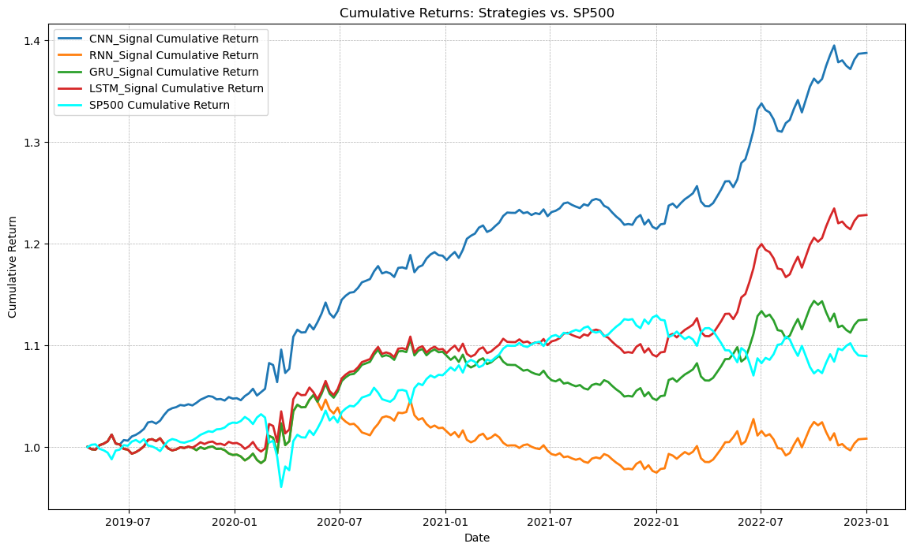
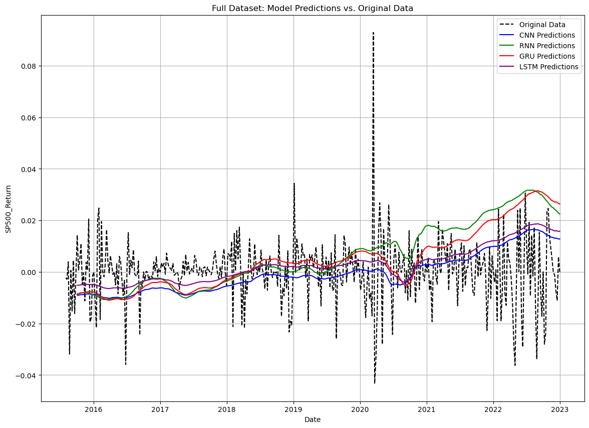

# Deep Index Strategy — Summary

This project develops a deep learning-based feature extraction and prediction pipeline for market data, focusing on the VIX and SP500 returns.  
We combine preprocessing, AutoEncoder feature compression, and sequence models (CNN, RNN, GRU, LSTM) to generate predictive signals.

---

## Workflow
1. **Data Preprocessing**
   - Integrated macroeconomic, commodity, and index data.
   - Generated variations excluding certain features for robustness checks.
2. **Feature Compression**
   - Applied an AutoEncoder to reduce dimensionality while preserving predictive information.
3. **Prediction Models**
   - Trained CNN, RNN, GRU, and LSTM models to forecast VIX and SP500 returns.
4. **Trading Strategy**
   - Generated buy/sell signals from model outputs.
   - Backtested on SP500 with cumulative returns tracking.

---

## Key Results

**1. Model Predictions vs SP500 Returns**

**2. Cumulative Returns of Strategies**

---

## Full Notebook
See [`0_main.ipynb`](0_main.ipynb) for:
- Full preprocessing steps
- Model training code
- Extended plots
- Evaluation metrics
